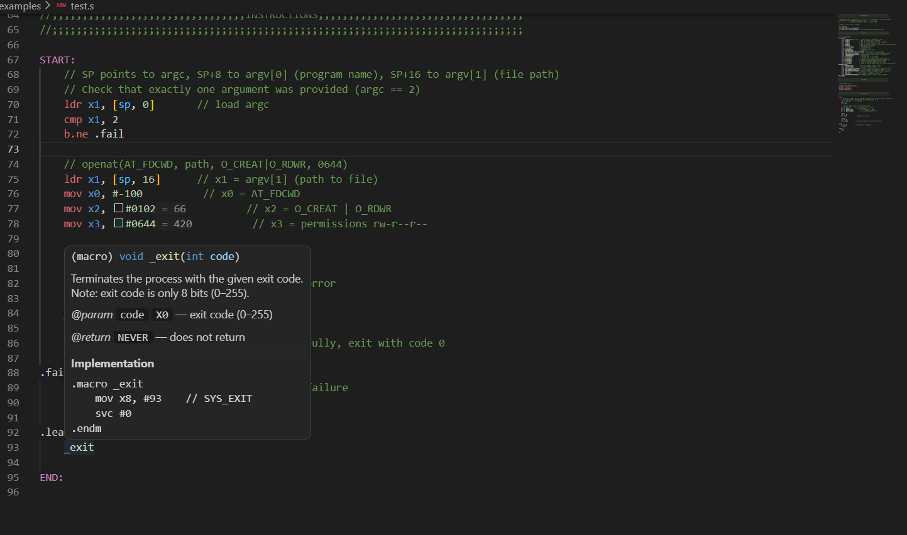

# ARM64 Assembly (GNU AS) — VS Code Extension

> The most complete ARM64/AArch64 editor support available — built for programmers
> who write **real** assembly: no libc, no runtime, just the hardware and Linux syscalls.



---

## What this extension does

Writing ARM64 is already hard. Your editor shouldn't make it harder.

This extension brings first-class GNU Assembler support to VS Code: full syntax
highlighting tuned for AArch64, inline documentation for every register and macro,
and navigation features that actually understand ARM64 structure — labels, `.macro`
definitions, and local labels included.

Everything works out of the box. No language server to configure, no extra tools to
install, no libc required.

---

## Features

### Syntax Highlighting

Complete TextMate grammar — works with all VS Code themes.

| Token | Examples |
|---|---|
| Registers (GPR 64-bit) | `x0` `x8` `x29` `x30` |
| Registers (GPR 32-bit) | `w0` `w8` `wzr` `wsp` |
| Registers (FP/SIMD) | `v3.8b` `q0` `d15` `s0` |
| Registers (system) | `nzcv` `daif` `vbar_el1` `tpidr_el0` |
| Instructions — branch | `b.eq` `bl` `cbz` `ret` |
| Instructions — memory | `ldr` `str` `ldp` `stp` `ldar` `stlr` |
| Instructions — arithmetic | `add` `sub` `mul` `udiv` `madd` |
| Instructions — logical | `and` `orr` `eor` `lsl` `ror` |
| Instructions — SIMD/FP | `fmul` `fadd` `dup` `tbl` `zip1` |
| Instructions — system | `svc` `mrs` `msr` `isb` `dsb` |
| GNU AS directives | `.macro` `.include` `.equ` `.section` `.cfi_startproc` |
| Numeric literals | `#0xFF` `#0b101` `#0644` `#42` |
| Labels | `START:` `.Lloop:` `.fail:` |
| Macro parameters | `\param` |
| Comments | `// line` `@ line` `/* block */` |

### Inline Decimal Hints

Hex, octal, and binary literals show their decimal value inline — no mental
arithmetic needed when reading memory flags, syscall numbers, or permissions.

```asm
mov x2, #0102          // x2 = O_CREAT | O_RDWR    → 66
mov x3, #0644          // x3 = permissions rw-r--r-- → 420
```

### Macro Hover Documentation

Hover over any macro call to see its full documentation: signature, description,
parameters, return behavior, and the actual implementation body.

```asm
_exit    // hover → (macro) void _exit(int code)
         //         Terminates the process with the given exit code.
         //         @param code  X0 — exit code (0–255)
         //         @return NEVER — does not return
         //         Implementation: mov x8, #93 / svc #0 / .endm
```

### Register Hover Documentation

Hover over any register to see its ABI role and calling convention.

| Register | Hover |
|---|---|
| `x0` | Argument 1 / return value. Caller-saved. |
| `x8` | Indirect result / **Linux syscall number**. Caller-saved. |
| `x29` | Frame pointer (FP). Callee-saved. |
| `sp` | Stack pointer. Must be 16-byte aligned at public interfaces. |
| `v3.8b` | 128-bit vector register. Arrangements: .8b .16b .4h .8h .2s .4s .1d .2d |
| `vbar_el1` | Vector base address register EL1 — base of the EL1 exception vector table. |

Covers all ~200 AArch64 registers: `x0–x30`, `w0–w30`, `v0–v31`, `q/d/s/h/b 0–31`,
`sp`, `lr`, `fp`, `xzr`, `wzr`, and a comprehensive set of system registers.

### Go-to-Definition

Press **F12** or **Ctrl+Click** on any label or macro reference to jump to its
definition. Supports standard labels (`START`), local labels (`.Lloop`, `.fail`),
and macro definitions across workspace files.

---

## Who this is for

This extension is built for ARM64 programmers who like to have some fun coding only in assembly:

---

## Requirements

- VS Code **1.95.0** or later
- Files with `.s` or `.S` extension are automatically detected as `arm64-asm`

---

## Quick Start

1. Install from the VS Code Marketplace (search **"ARM64 Assembly"**)
2. Open any `.s` or `.S` file — syntax highlighting activates automatically
3. Hover a register or macro to see inline documentation
4. Ctrl+Click a label to jump to its definition

---

## Contributing

Issues and pull requests are welcome on [GitHub](https://github.com/YOUR_GITHUB/vscode-arm64-assembly).

If you find a missing instruction, register, or directive, please open an issue —
ARM64 has a large ISA and contributions are very much appreciated.

See [CONTRIBUTING.md](CONTRIBUTING.md) for dev setup and guidelines.

---

## License

MIT — see [LICENSE](LICENSE).
