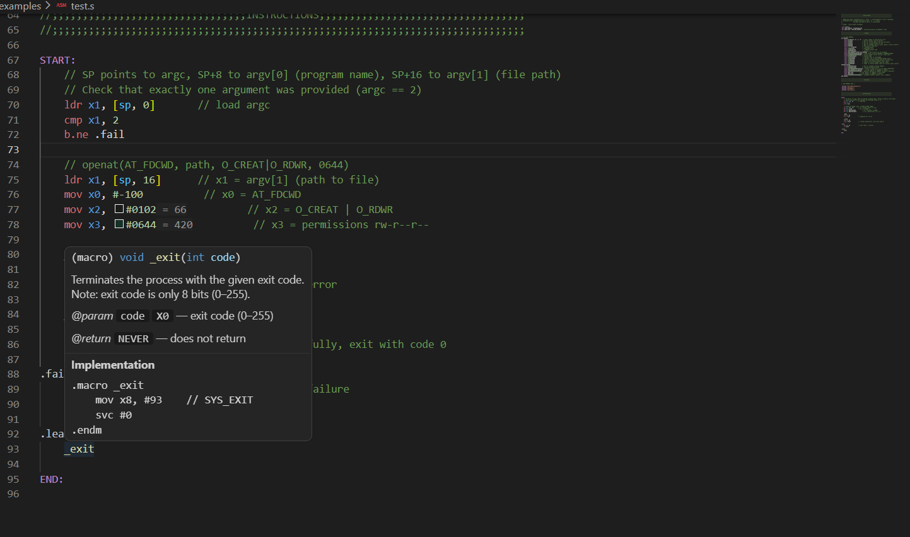

# ARM64 Assembly (GNU AS) — VS Code Extension

> The most complete ARM64/AArch64 editor support available — built for programmers
> who write just assembly: no libc, no runtime, just the hardware and Linux syscalls.



---

## What this extension does

Writing ARM64 is already hard. Your editor shouldn't make it harder.

This extension brings first-class GNU Assembler support to VS Code: full syntax
highlighting tuned for AArch64, inline documentation for every register and macro,
and navigation features that actually understand ARM64 structure — labels, `.macro`
definitions, and local labels included.

Everything works out of the box. No language server to configure, no extra tools to
install, no libc required.

---

## Features

### Syntax Highlighting

Complete TextMate grammar — works with all VS Code themes.

| Token | Examples |
|---|---|
| Registers (GPR 64-bit) | `x0` `x8` `x29` `x30` |
| Registers (GPR 32-bit) | `w0` `w8` `wzr` `wsp` |
| Registers (FP/SIMD) | `v3.8b` `q0` `d15` `s0` |
| Registers (system) | `nzcv` `daif` `vbar_el1` `tpidr_el0` |
| Instructions — branch | `b.eq` `bl` `cbz` `ret` |
| Instructions — memory | `ldr` `str` `ldp` `stp` `ldar` `stlr` |
| Instructions — arithmetic | `add` `sub` `mul` `udiv` `madd` |
| Instructions — logical | `and` `orr` `eor` `lsl` `ror` |
| Instructions — SIMD/FP | `fmul` `fadd` `dup` `tbl` `zip1` |
| Instructions — system | `svc` `mrs` `msr` `isb` `dsb` |
| GNU AS directives | `.macro` `.include` `.equ` `.section` `.cfi_startproc` |
| Numeric literals | `#0xFF` `#0b101` `#0644` `#42` |
| Labels | `START:` `.Lloop:` `.fail:` |
| Macro parameters | `\param` |
| Comments | `// line` `@ line` `/* block */` |

### Inline Decimal Hints

Hex, octal, and binary literals show their decimal value inline — no mental
arithmetic needed when reading memory flags, syscall numbers, or permissions.

```asm
mov x2, #0102          // x2 = O_CREAT | O_RDWR    → 66
mov x3, #0644          // x3 = permissions rw-r--r-- → 420
```

### Macro Hover Documentation

Hover over any macro call to see its full documentation: signature, description,
parameters, return behavior, and the actual implementation body.

```asm
_exit    // hover → (macro) void _exit(int code)
         //         Terminates the process with the given exit code.
         //         @param code  X0 — exit code (0–255)
         //         @return NEVER — does not return
         //         Implementation: mov x8, #93 / svc #0 / .endm
```

### Register Hover Documentation

Hover over any register to see its ABI role and calling convention.

| Register | Hover |
|---|---|
| `x0` | Argument 1 / return value. Caller-saved. |
| `x8` | Indirect result / **Linux syscall number**. Caller-saved. |
| `x29` | Frame pointer (FP). Callee-saved. |
| `sp` | Stack pointer. Must be 16-byte aligned at public interfaces. |
| `v3` | 128-bit vector register. Arrangements: .8b .16b .4h .8h .2s .4s .1d .2d |
| `vbar_el1` | Vector base address register EL1 — base of the EL1 exception vector table. |

Covers all ~200 AArch64 registers: `x0–x30`, `w0–w30`, `v0–v31`, `q/d/s/h/b 0–31`,
`sp`, `lr`, `fp`, `xzr`, `wzr`, and a comprehensive set of system registers.

### SIMD Lane Hover Documentation

Hover a vector operand that carries an arrangement or a lane index to see exactly
how the 128 bits are divided — lane count, element width, and the bit range of
every lane.

```asm
fadd v1.4s, v2.4s, v3.4s    // hover v1.4s → 4 lanes × 32 bits (int32 / float)
                            //   ┌────────┬────────┬────────┬────────┐
                            //   │   s[3] │   s[2] │   s[1] │   s[0] │
                            //   │ 127:96 │  95:64 │  63:32 │   31:0 │
                            //   └────────┴────────┴────────┴────────┘
ins  v0.d[1], x0            // hover v0.d[1] → one 64-bit lane at bits 127:64
movi v4.8b,  #0             // hover v4.8b  → lower 64 bits only; 127:64 zeroed
```

Every hover also lists the other arrangements of the same register, so switching
between `.16b`, `.8h`, `.4s`, and `.2d` is one glance away. Out-of-range lane
indices (`v0.s[9]`) are flagged instead of silently documented.

### Instruction Hover Documentation

Hover any mnemonic for its purpose, operand forms, and the caveats that bite —
covering the general-purpose, branch, and system instructions plus **~120
floating-point and SIMD/NEON** ones.

```asm
fcmp   d0, d1     // hover → sets NZCV, plus the FP condition-code table
                  //         (which conditions are NaN-safe and which are not)
movi   v0.16b, #0 // hover → immediate encoding rules; the idiom for zeroing
fmla   v0.4s, v1.4s, v2.4s   // hover → warns that Vd is read-modify-write
fcvtzs w0, s0     // hover → rounding mode, saturation, inverse (SCVTF)
```

Mnemonics that exist in both worlds (`add`, `orr`, `ldr`, `mov`, …) show the
scalar documentation followed by the vector form.

### Diagnostics

Mistakes are underlined as you type, after a 300 ms pause. The analysis is
line-based regex work, so it stays cheap even on large files. Everything lands
in the Problems panel, so **F8** / **Shift+F8** step through them,
**Ctrl+Shift+M** opens the list, and **Ctrl+.** offers a fix. A status-bar
counter shows the active file's totals and opens the panel on click.

```asm
add   sp, sp #16      // Error: missing comma between operands
add,  sp, sp, #16     // Error: stray comma after the mnemonic
b     ret_x           // Warning: not defined here — did you mean `.ret_x`?
dq    5               // Error: `dq` does not exist in GNU as — the equivalent is `.quad`
.quad 1.56            // Error: `.quad` only takes integers — use `.double`
.byte 300             // Warning: does not fit in 1 byte — truncated to 0x2C
.elif x == 15         // Warning: unknown directive — did you mean `.elseif`?
mov   x3, [x4]        // Error: MOV does not reach memory — use LDR
str   x0, x1          // Error: STR needs a bracketed address
add   x0, w1, x2      // Error: mixed register widths — all x or all w
fadd  v0.4s, v1.2d, v2.4s   // Error: mismatched vector arrangement
ins   v10.s[9], w0    // Error: `.s` has 4 lanes, so the index runs 0 to 3
```

Severities are not guesswork: each rule was checked against
`aarch64-linux-gnu-as` (binutils 2.38), and reports the severity the assembler
itself uses. That is why `.byte 300` is a warning (GAS truncates and carries on)
while `.quad 1.56` is an error (GAS refuses the line).

Every family can be re-levelled or switched off independently — each accepts
`error`, `warning`, `information`, `hint` or `off`:

| Setting | Default | Reports |
|---|---|---|
| `arm64asm.diagnostics.syntax` | `error` | missing comma, stray comma, unbalanced bracket, unterminated string, empty operand |
| `arm64asm.diagnostics.directives` | `error` | `dq`/`dd`/`resb`/`%macro`, `.quad 1.56`, `.ascii` without quotes |
| `arm64asm.diagnostics.unknownDirective` | `warning` | a directive not in the built-in list |
| `arm64asm.diagnostics.dataTruncation` | `warning` | a value wider than its data directive |
| `arm64asm.diagnostics.operands` | `error` | an operand shape no encoding of the instruction accepts |
| `arm64asm.diagnostics.vectors` | `error` | lane index out of range, mismatched vector arrangements |
| `arm64asm.diagnostics.symbols` | `warning` | a label, macro or `.equ` name nothing defines |
| `arm64asm.diagnostics.immediateHash` | `warning` | a constant written without `#` |

Two more knobs: `arm64asm.diagnostics.enable` turns the whole thing off, and
`arm64asm.diagnostics.delay` changes the 300 ms debounce.

**A note on the `#`.** In AArch64 the `#` before an immediate is *optional* —
`add sp, sp, 16` assembles cleanly. So that rule is about consistency, not
correctness, and it is the one most likely to be noise in an existing codebase.
Turn it off with:

```jsonc
"arm64asm.diagnostics.immediateHash": "off"
```

**Suppressing a single line.** When a rule is wrong about your code, say so
inline rather than switching the family off:

```asm
        add     sp, sp, 16      // arm64asm-ignore-line
        b       external_thing  // arm64asm-ignore: symbols
```

**Operand checking is opt-in per instruction.** Forms are validated against a
table of roughly 300 mnemonics. A mnemonic missing from that table is simply not
checked — the table is allowed to be incomplete, but never wrong. The same
caution runs through the rest: of the 105 real assembly files used to develop
this, the 55 that `aarch64-linux-gnu-as` accepts with no message produce no
errors here either.

**Scope.** Symbols are resolved in the current file plus one level of
`.include` (using `arm64asm.includePaths`, GAS's `-I`). Because a `bl` to a
function in a separately-assembled file is perfectly normal, unresolved names
are only reported when they are a near miss against a name that *does* exist, or
when they are local labels — which cannot come from the linker.

`examples/lint_errors.s` and `examples/lint_clean.s` show every rule firing and
every trap it must not fall into.

### Go-to-Definition

Press **F12** or **Ctrl+Click** on any label or macro reference to jump to its
definition. Supports standard labels (`START`), local labels (`.Lloop`, `.fail`),
and macro definitions across workspace files.

---

## Who this is for

This extension is built for ARM64 programmers who like to have some fun coding only in assembly:

---

## Requirements

- VS Code **1.95.0** or later
- Files with `.s` or `.S` extension are automatically detected as `arm64-asm`

---

## Quick Start

1. Install from the VS Code Marketplace (search **"ARM64 Assembly"**)
2. Open any `.s` or `.S` file — syntax highlighting activates automatically
3. Hover a register or macro to see inline documentation
4. Ctrl+Click a label to jump to its definition

---

## Learning Resources

For a deep dive ARM64/x86_64 assembly
programming really from basics to hard stuff — check out:

- [SCHIZONE](https://github.com/xmdi/SCHIZONE) — hands-on assembly lessons

---

## Contributing

Issues and pull requests are welcome on [GitHub](https://github.com/Felipenguim/vscode-arm64-assembly).

If you find a missing instruction, register, or directive, please open an issue —
ARM64 has a large ISA and contributions are very much appreciated.

See [CONTRIBUTING.md](CONTRIBUTING.md) for dev setup and guidelines.

---

## License

MIT — see [LICENSE](LICENSE).
